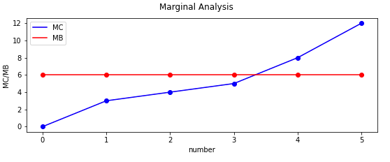
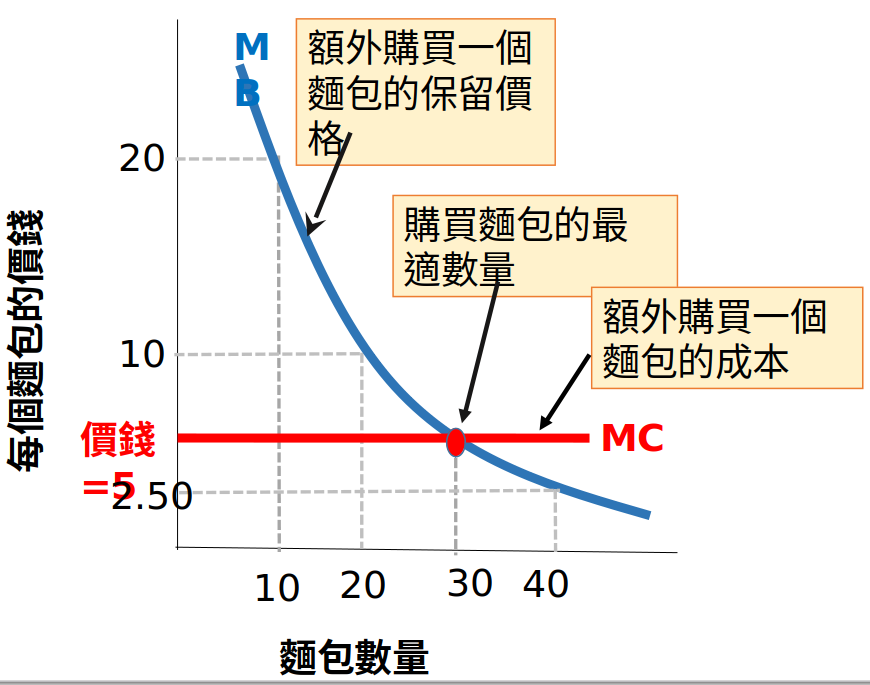
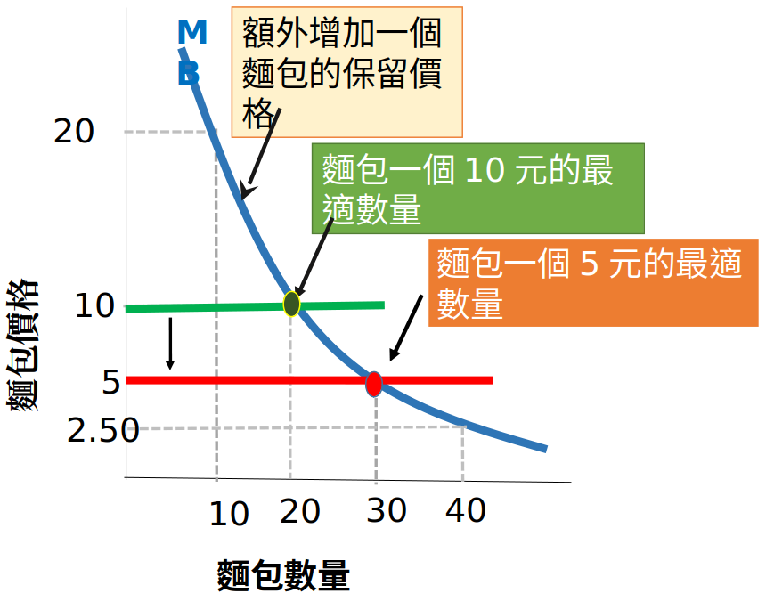
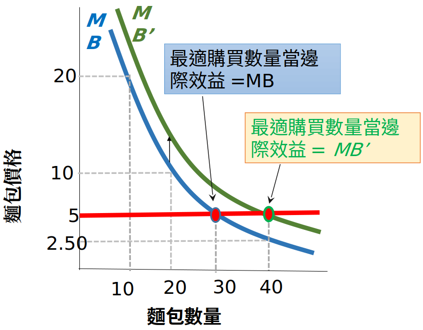
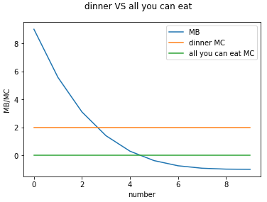

# 1_經濟學與實習

## 稀少性原則 scarcity principle
* 經濟學的出發點，就在於資源有限的限制下，如何追求最小成本與最大效益之間的兩難
* 唯其資源是稀少而有限的，才有資源應用極大化的必要與可能；沒有限制式就沒有極大化

## 理性原則 rational principle
* 經濟學的出發點，假設人是理性的 (rational)

## 成本效益原則 cost-benefit principle
* 如果執行一個動作帶來的額外 (additional, incremental) 效益大於額外成本，就繼續執行

## 保留價格 reservation price
* 保留價格是人們心目中對某一事物的衡量，內心賦予的一個價錢
* 從效益面來看，等於消費某一財貨或勞務所得到的效益，是人們願意出的最高價格
* 從成本面來看，等於供給某一財貨或勞務所承擔的成本，是人們願意接受的最低價格
* 例子
    * 工資都是 50 元，等於給定效益50元
    * 每個職業的成本都不同

| 職業 | 效益 | 成本 |
| ----|-----|---|
|捕魚 | 50| 200|
|農耕 |50| 100|
|作業員|50| 70|

## 經濟剩餘 economic surplus
* 效益超過成本的部份，就是經濟效益
    * Economic Surplus = Benefit - Cost
* 在某一段合理時間範圍內，理性個人追求正的經濟剩餘加總最大化

## 機會成本 opportunity cost
* 機會成本：採取某一行動之後，所必須放棄的次佳選擇 (the next best alternative)
* 幾乎所有的決策，都取決於機會成本
    * 例如：自有房子拿來做生意，少收的房租就是機會成本
    * 例如：唸書無法工作，少賺的工資就是機會成本
* 討論決策的機會成本時，只注重次佳的最高成本，不是加總全部 (無法計算)
## 邊際概念 concept of marginal 
* 邊際效益 Marginal Benefit 
    * 額外增加一單位購買，總效益的增量
* 邊際效益隨著數量變化，可能遞增、遞減、持平；最終一定會遞減
    * 邊際效益遞減法則：law of diminishing marginal benefit
    * 邊際報酬遞減法則：law of diminishing marginal return
* 邊際成本 Marginal Cost 
    * 額外增加一單位供給，總成本的增量
* 邊際成本隨著數量變化，可能遞減、遞增、持平；最終一定要遞增
    * 邊際成本遞增法則：law of increasing marginal cost
* 例子

|Launches|Total Cost|Average Cost|Marginal Cost|
|-------|-----------|-----------|------------|
|0|$0|$0|$3|
|1|$3|$3|$4|
|2|$7|$3.5|$5|
|3|$12|$4|$8|
|4|$20|$5|$12|
|5|$32|$6.4|-|

If the marginal benefit is $6 billion per launch, how many launches should SpaceX make? 
Answer: 3 ~ 4 

#### 最適的購買量 Optimal Level of purchase
* 在某一財貨或勞務的購買上，如何決定最適購買量
* 當邊際效益大於邊際成本：經濟剩餘為正，繼續購買
* 當邊際效益小於邊際成本：經濟剩餘為負，減少購買
* 最適決策點：邊際成本等於邊際效益時
* 這是均衡點的概念；MB = MC
* 表示在這個點時邊際成本等於邊際效益，處於臨界點
* 另一個經濟意義是，MB = MC 時保證經濟剩餘加總最大化
* 因為從經濟剩餘為正持續加總到經濟剩餘為0的時候停下來
* 例子

###### 圖1 .1 購買麵包的成本效益分析

###### 圖1.2 麵包價格下跌最適購買量會增加

###### 圖 1.3 麵包的邊際效益增加最適購買數量也增加

## 假說的檢定 hypotheses testing
* 給定前述這麼多經濟學原則，可以建構模型
* 實際運用在模型建構上，必須能夠經得起檢驗
* 以圖形說明邊際效益和邊際成本，決定最適量

## 其他例子
* 便利超商2人經濟學隱含哪些經濟原則？
    * 邊際效益遞減，所以第二件商品必須更便宜，消費者才會更有意願買
* Buffet 吃到飽和平常吃飯的行為比較－如何用模型表示？
    * 吃到飽因為已經付了入場費，這費用已經變成沉沒成本，所以不管吃多少，邊際成本(MC)都是 0 ，所以要吃到 4 ~ 6 才會停下來
    * 平常吃飯的邊際成本(MC) 是 2 ，所以要吃到 2～4 才會停下來
    

## 討論單題目
* 哪些東西一次買多比較便宜？
    * 它原本的價值比成本低很多的情況，或是此物品的成本非常低，賣家必須以數量來賺取獲利，如砂石、水
 
* 哪種東西的生產成本結構和 Microsoft 的產品近似？
    * Google 雲端服務和搜尋引擎。Apple 的作業系統服務。以販賣軟體服務的優勢，在於大量生產是幾乎沒有成本，大多是在開發研究上要投資比較多
* 成本效益是否解釋絕大多數事情 
    * 是的。但如果牽扯到人的情感就不一定了，像是信物或是宗教，就無法單用成本效益
