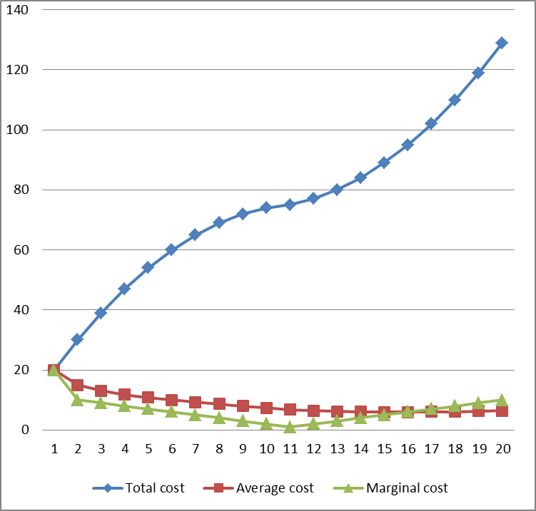

# 二、經濟學家的決策考量
## 機會成本 (opportunity cost) 的角色
* 機會成本：從事某一選擇之後，必須放棄的其他次佳選擇
* 嚴格說來，凡事幾乎都有機會成本
* 機會成本幾乎無所不在，也都是進行決策時無可忽視的考量

## 機會成本在時間軸向的角色
* 牽涉時間偏好率 (time preference)
    * 這個名詞是用來衡量，一個人對於"現在"的偏好度。時間偏好率越高的人，表示越注重目前、當下
* 在時間的軸向上，人們偏好現在使用資源更勝於未來使用資源
* 時間偏好率類似於利率概念
* 如果要你延遲使用資源，必須補償的代價，就是時間偏好率
* 時間偏好率高的表示缺乏耐心 (impatient)，時間偏好率低的表示有耐心 (patient)

## 貨幣的時間價值，時間的偏好
* 今天一元的價值，甚於未來的一元
* 如果錢不借人或借銀行，可以立即消費 (或投資)
* 銀行付出利息給存款者，就是補償存款人無法立即消費的機會成本
* 有些人存款多，有些人不願意存款，部分反映他們存款的機會成本不同

## 不要忽略機會成本
* 執行決策時必須將相關的機會成本納入考量
* 即使資源的取得是免費的，並不代表此資源沒有價值
* 資源的價值取決於其次佳用途，所以，資源最佳用途的決策和機會成本有關
* 不要忘記，時間軸向上也有機會成本的概念
#### 機會成本的考慮
* 在自家的房子開店經營生意,
* 總收益=500， 總成本(人工與進貨)=300, 會計利潤=200
* 機會成本：
    * 自有房屋的設算房租=100
    * 自己的設算薪資報酬=100
* 考慮機會成本的經濟利潤=0
* 若是忽略機會成本的考量，就一定會自營；未必是明智的決策

## 沈沒成本 (sunk cost) 的角色
* 沈沒成本 (Sunk cost)：做決策時無法回復的成本，是為沈沒成本
* 不管採取什麼行動，成本都已存在無法回復
* 所以，沈沒成本之下，採取什麼行動就無關緊要
#### 沈沒成本的例子
* 有三種情況取得藝術表演的門票
1. 友人送免費的票，價值500元
2. 開場前在窗口買票，票價350元
3. 之前透過某某藝術中心訂票付款300元，不能退票
* 在表演即將開演之前，三種票的成本各是多少
1. 0元； 2. 300元； 3. 350元； 4. 500元

## 不要加計沈沒成本
* 如果是無法回復的成本，就沒有其他的最佳選項 (best alternative) 問題
* 也就沒有機會成本，所以沈沒成本不應該影響決策
* 理性個人的決策，不應加計沈沒成本
* 不要讓沈沒成本影響決策

## 釐清平均 (average) 與邊際 (marginal) 的概念
* 追求平均成本最低和平均效益最高，是最適化的結果嗎？ 否
* 前述最適化的決策，是MB = MC
* 執行最適化決策時，邊際的概念才重要，平均概念並不重要

## 總成本、平均成本與邊際成本
* 平均成本是總成本除以總數量
* 平均效益是總效益除以總數量
* 邊際成本是額外增加 (**incremental, additional**) 一單位數量，帶來的成本增量
* 邊際效益是額外增加 (**incremental, additional**) 一單位數量，帶來的效益增量
* 平均與邊際的關係，可能大於、等於或小於，端視所在的數量而定
* 例子，平均成本或平均收益都看不出最適點，而平均收益和邊際收益的最適點是 **11**
    * 總成本，平均成本，邊際成本
    

    * 平均成本，邊際成本
    

    * 總收益、平均收益、邊際收益
    

    * 平均收益、邊際收益 
    

## 固定成本 (fixed cost) 與變動成本 (variable cost)

* 固定成本 Fixed Costs
    * 不隨著數量而變化的成本是為固定成本
    * 沈沒成本一定是固定成本，反之不成立
    * 為何？因為某些固定成本在做決策時可以回復，因為固定成本部一定是沉沒成本
    * 變動成本 Variable Costs
        * 隨著數量而變化的成本是為變動成本
    * 經濟學的長期 (long term) 和短期 (short term) 就是以有無固定成本來定義的
    * **有固定成本是短期，無固定成本是長期**
    * 長期和短期的是經濟學最好的定義之一，隨著討論項目而自動調整
    * 例子：固定成本和變動成本
        * 貨運公司一個月有30班次，總成本3,000元，平均每一班次的成本是100元
        * 假設某天的班次只有80元的收益
        * 每個班次的司機工資和汽油是50元 
        * 請問貨運公司是否該出動這個班次
        * 是否出動班次的考慮是什麼 
        * 要出班，因為工資和汽油都已經是固定成本了，所以不出班，就賠 100 元，如果出班的話，就賠 20 元，
## 討論主題
* 機會成本的大小和什麼相關？和選擇的多寡相關
    * 每個選項的價值差距，如果差距越大，機會成本越大，跟選擇多廣無關
* 哪一種人的時間偏好率比較高？
    * 投機客
* 什麼時候人們會忽略機會成本？
    * 當只有一個選擇或是沒有選擇的時候
* 什麼時候人們會加計沈沒成本？
    * 當這個成本還可以彌補的時候，就必須列入考慮
* 什麼時候我們用平均的概念做決策？
    * 當物品無法用一個數字衡量的時候
* 什麼時候用邊際的概念做決策？
    * 當物品可用一個數字衡量的時候
* 什麼時候固定成本重要？什麼時候變動成本重要？
    1. 當固定成本過高的時候
    2. 當變動成本隨著時間變動太大