# 3 比較利益的存在

## 比較利益原則 The Principle of Comparative Advantage 
* 專業化的過程就是趨向比較利益的發揮
* 專業化是每個人專精於自己的領域或技術
* 專精的定義，是可以用比較少的時間或資源，生產較多的財貨或勞務；換句話說，更有效率
* 更有效率有兩種可能：一種是生產成本較低，一種是機會成本較低
*  生產成本較低是絕對利益 
*  機會成本較低是比較利益 
* 透過專業化與貿易，使得產出總值增加
* 如果每個人或國家都依照機會成本最低的原則來生產，就可以達到最佳的生產狀態

## 機會成本遞增原則 The Principle of Increasing Opportunity Cost 
* 在生產過程中，機會成本都是遞增的
* 機會成本是放棄的最佳選擇 (the next beast alternative)
* 生產某一物品時，先從機會成本最低的資源放棄
* 低果先摘原則 (the Low-Hanging-Fruit Principle) 

## 絕對利益 absolute advantage v.s. 比較利益
* 絕對利益和比較利益的討論，一定是在兩種以上財貨的模型才有意義 
* 如果只有生產一種產品，不管成本高低的人都應該投入生產，沒有比較利益或絕對利益的差別考量
* 在兩個財貨的模型中，多生產一個財貨就少生產另外一個財貨，機會成本就是兩種財貨在生產過程的交換比例
* 以生產可能線來描述生產過程 

## 生產可能線 production possibility curve  (PPC)
* 一個人可用資源達到的生產最大可能組合的上界 (upper bound)，用圖形來表達
* 機會成本表現在生產可能線的斜率上 
* 斜率高低，就代表機會成本的大小
* 例子(絕對利益)
    * 假設有甲乙兩人，分別會生產蔬菜和肉類
    * 每人每天都有八小時生產量如下圖

    |人|蔬菜|肉類|
    |---|----|----|
    |甲| 16 |24|
    |乙|8|8|
    * 在同樣的時間下(每小時)，乙在兩種產品的生產量比甲少

    |人|蔬菜|肉類|
    |---|----|----|
    |甲| 2 |3|
    |乙|1|1|
    * 甲對乙而言是有絕對利益
    * 乙對甲而言是沒有絕對利益 (就是不利益)
    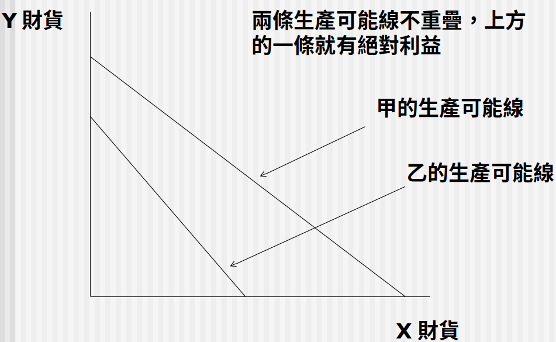

* 例子（相對利益）
    * 假設有甲乙兩人，分別會生產蔬菜和肉類
    * 每人每天都有八小時生產量如下圖

    |人|蔬菜|肉類|
    |---|----|----|
    |甲| 16 |24|
    |乙|24|16|
    * 甲相對乙而言是有比較利益
    * 乙相對甲而言是也有比較利益

    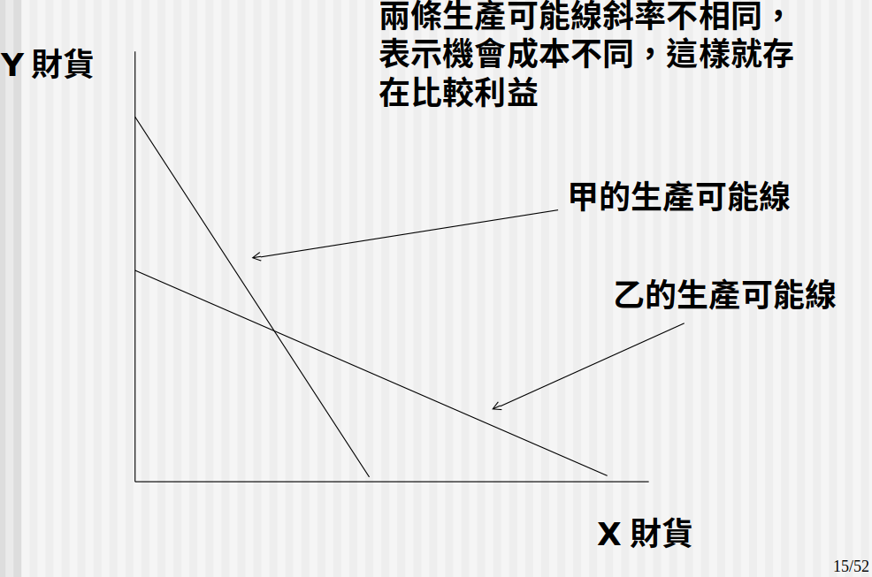

## 比較利益的來源	
* 從個人來看
    * 與生俱來的聰明才智
    * 教育與訓練，因此有不同的技能
    * 轉換不同居住地也可能帶來比較利益

* 就國家而言
    * 文化或制度的差異
    * 勞力密集與資本密集的國家稟賦 (endowment)
    * 語言，文化與社會習慣 (social norm)
    * 對商業精神的重視，對生活細節的講求

## 生產可能線的可及點與不可及點(Attainable and Unattainable)
* 可及點 Attainable
    * 在所擁有的資源內可以生產的各種可能組合
* 不可及點 Unattainable
    * 在所擁有的資源內無法生產的可能組合，也就是超過生產可能的範圍

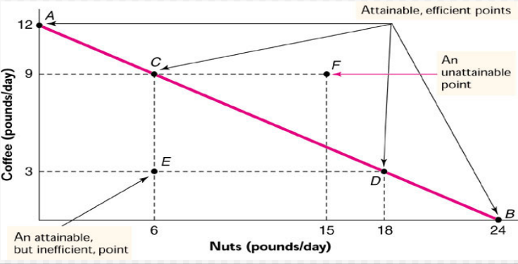

## 生產可能線的效率點與不效率點(Efficient and Inefficient)
* 效率的生產點
    * 效率的生產點把時間全部都用完，如果要增加一種產品的生產，必須以另外一種產品的減產為代價；此時為效率生產
    * 效率的生產點應該在生產可能的邊界上
* 不效率的生產點
    * 不效率的生產點沒有把時間全部都用完，要增加一種產品的生產，不必然要以另外一種產品的減產為代價；此時的生產是不效率的
    * 不效率的生產點應該在生產可能的邊界內

## 專業化分工下的貿易利得
* 即使某些生產者具有絕對利益，依照比較利益的專業化分工仍有好處
* 從機會成本角度來看比較利益
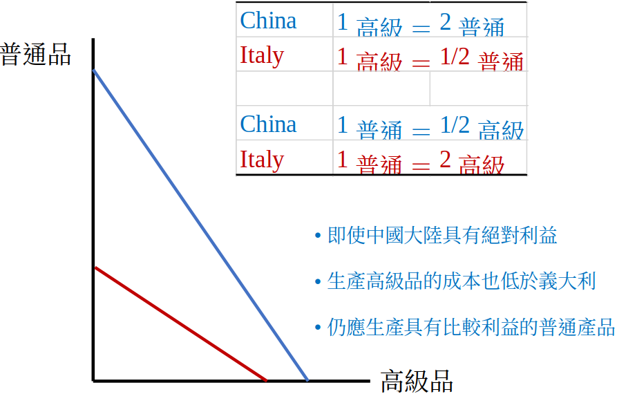

* 合作前（自給自足）：看個人偏好，coffee生產點等於 nut 生產點，所以 Susan 和 Tom 都獲得 8 coffee 和 8 nuts
* 合作後：考慮比較利益，Susan生產 24 coffee， Tom生產 24 nuts，交換之後，Susan 和 Tom 都獲得  12 coffee 和 12 nuts

    |狀態                |coffee|nuts| 合作|
    |------------------ |----|------|------|
    |合作前（Tome Susan分開看）  | 8   |8     |無|
    |合作後（Tom Susan看成一體）|12   |12     |Tome 給 Susan 12 nuts ， Susan 給 Tom 12 coffee|

    * Tom 自給自足

    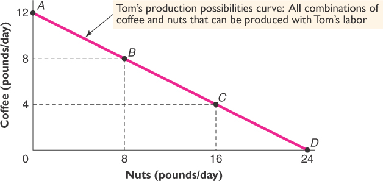
    * Susan 自給自足

    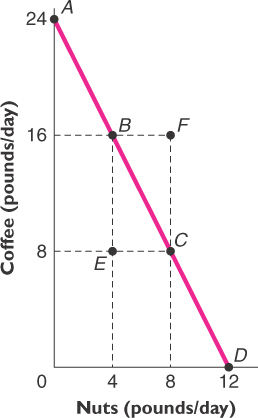
    * Tom 和 Susan 合作 

    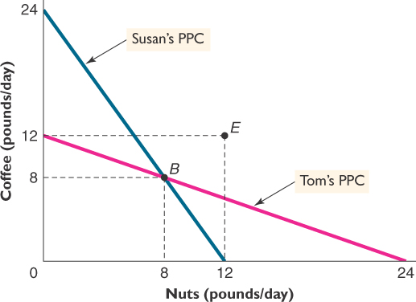

* 線段斜率相同，沒有比較利益，有絕對利益
* 線段重合，沒有比較利益和絕對利益 

## 多人生產線的加總
* 兩人經濟體的生產可能線，兩條生產可能線如何相加，是凹向原點
* Tom 和 Susan 的例子
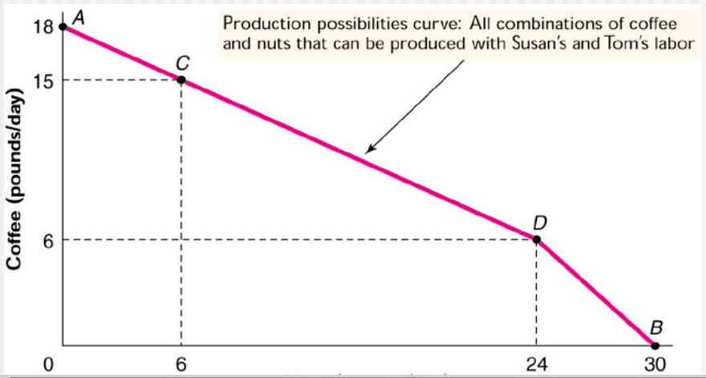

* 多人大型經濟下，許多個人的生產可能線堆疊相加，依照機會成本遞增的原則，最後形成平滑外曲凹向原點的PPC，並符合低果先摘原則
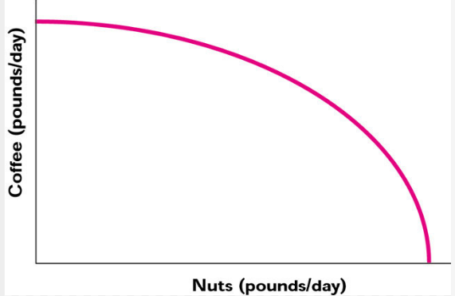

## 生產可能線的移動
* Increases in productivity shift the PPC out
* 生產力增加, 生產可能線外移
* 生產力下降, 生產可能線內移
* 生產力變動, 生產可能線的斜率變動
* 生產可能線的斜率代表什麼?
    * 機會成本

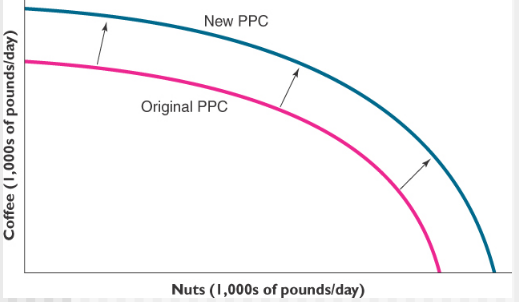

* coffee 和 nuts 的製作技術提昇

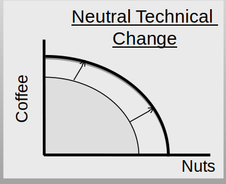
* coffee 的製作技術提昇

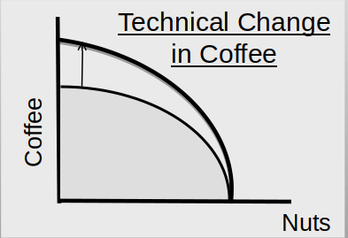
* nuts 的製作技術提昇

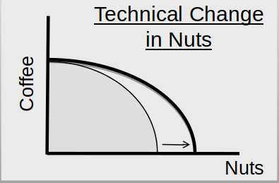

## 比較利益在國際貿易的體現 Comparative advantage embodied in international trade
* 貿易帶來好處，不管對手國的大小
* 沒有貿易，就必須面對較高的機會成本
* 看世界各地風起雲湧的自由貿易協定就可以理解
* 國際貿易的成長率超越以往任何一個時期
* 透過國際貿易,消費可能曲線大幅擴張,結果和偏好有關

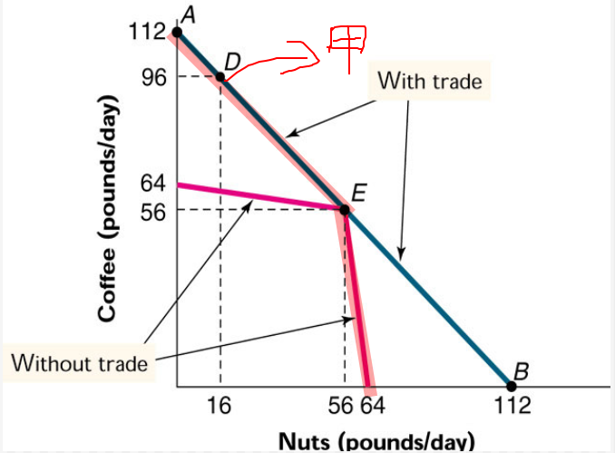

# 課後討論主題
* 哪裡沒有比較利益原則的運作？
    * 若以國家為單位，就是只討論一個國家時，就沒有比較利益 
* 為何機會成本是遞增而非遞減的？機會成本可能遞減嗎？
    1. 因為低果先摘理論，人們會從成本低的事情做起
    2. 可能，那前提人並非理性
* 如何說明公平的貿易一定帶來好處？
    * 那就會發揮比較利益的最大效益，讓市場自己做調節
* 自己國家不使用的東西有沒有可能出口到其他國家去？例子？
    * 台灣生產手機的晶片，但是並不會做一台完整的 apple 手機
* 臺灣其他國家或地區生產的農產品，是否會造成臺灣農業變廢墟：如果進口稻米？豬肉？火雞肉？牛肉？中藥材？高麗菜？大蒜？
    * 要看那個農村人民的心態，如果不想要找到自己村子的生產優勢，而去轉型就一定會被在國際貿易中淘汰，但如果他們偶好好發揮自己的比較利益，一定可以獲得更大的利益。