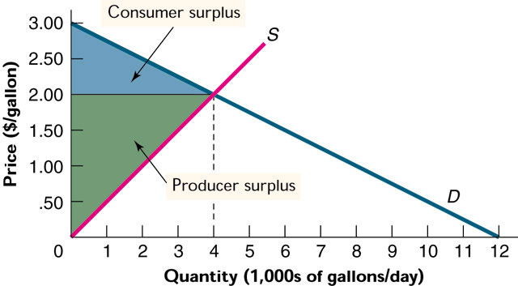
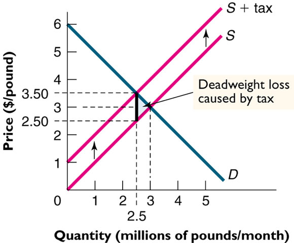

# 4.3、市場、租稅與效率

## 市場的範疇 The Domain of Markets
* 自由市場提昇效率，讓資源配置尋求最適解
    * 透過供需模型可以瞭解
    * 但是市場並不是萬靈丹
    * 市場並不能解決所有問題
    * 例如所得分配均等化就不是市場機制可以自動解決的
* 市場不能解決所有問題，並不表示市場機制不好
* 但有些對市場的誤解，由此發生
## 市場均衡與效率 Market Equilibrium and Efficiency
* 柏拉圖效率 Pareto efficient 
    * 不損人無法利己時的狀況；變動資源配置有利於一方時，一定有另一方受害時，就是達到效率狀態
    * 以黑羊與白羊過獨木橋的故事為例
    * 假設每隻羊所站的位置和出發點的距離，代表它所擁有的資源
    * 當兩隻羊鼻尖碰著鼻尖時，就是效率狀態
    * 完全競爭市場的均衡是 Pareto efficient
* 例子
#### 價格低於均衡價格時，是Pareto Efficient，為什麼？
答案：超額需求的情況下，增加交易時，經濟剩餘也會增加，沒有人受害

#### 如果額外增加一單位銷售,價格定在1.75，對於買者和賣者的影響如何?

答案：造成超額供給，導致浪費

## 經濟剩餘
* 總經濟剩餘 = 邊際效益減邊際成本的加總
    * 消費者剩餘 Consumer Surplus
        * 保留價格與實際支付價格的差距
    * 生產者剩餘 Producer Surplus
        * 保留價格與實際收取價格的差距
* 經濟剩餘的大小可以用來衡量經濟體達成效率的高低

#### 消費者與生產者剩餘

#### 消費者與生產者剩餘可以無限細分的產品

## 剩餘與效率
* 均衡價格與數量下，經濟剩餘達到極大化
    * 總的經濟剩餘在非均衡價格下都比較少
    * 因為有浪費產生
    * Smart for one, dumb for all.
* 效率不是唯一的目標
    * 所得平均分配是一大目標
* 但是效率是第一個目標
    * 效率的前提下，可以將其他的目標推到極致
    * 效率可以極小化浪費

### 價格上限 Price Ceilings
* 價格不能高過某一水準
    * 目的是讓窮人以低價購買物品
    * 但是結果造成經濟剩餘的減少
    * 但是同樣的目標，可以由其他較少浪費的方法達成
* 價格管制下帶來的浪費，只要以少於同樣浪費的課稅達到同樣目的，都是可以被接受而更有效率的
* 以課稅及所得重分配取代價格管制，對於窮人的益處更大
* 把社會的餅做大，才會有多的剩餘，所以效率是第一目標，公平是第二目標

**暖氣用煤油市場—未有價格管制時**

**價格管制下的浪費 Lost = $800**

**未管制房屋市場, 總剩餘$2,000,000**

**房價管制下，經濟剩餘損失$500,000**

## 租稅與效率性
* 價格不能低於某一水準
    * 減少經濟剩餘
    * 目的是讓貧窮的農業家庭可以用較高的價格賣出農產品
    * 但是，一樣的目的可以用更為有效率的方法達成

**未經管制的小麥市場** 

**價格管制的小麥市場,p=40,政府買一半,但是有一大塊區域是經濟剩餘的浪費(按照定義來做,價格上方是CS,下方是PS,加上損失)**

## 租稅與經濟剩餘
* 政府加稅之後，對物價有何影響
    * 大多數人以為價格會如稅率幅度上漲
    * 其實不然，價格上漲的幅度，不一定和稅率一樣
    * 大多數人以為加稅之後都由消費者承擔
    * 其實不然，消費者和生產者同時承擔稅負
    * 承擔的比例高低和供給與需求的彈性有關
    * 直觀來看，彈性小的一方承擔租稅的壓力大

**消費者和生產者各承擔一半的稅**

**供給曲線為水平，稅賦都為買者所負擔**

**需求曲線為垂直的情況,租稅由賣者負擔**

----------------------------------------------

**沒有租稅，總經濟剩餘$9**

**加入租稅總經濟剩餘減少,只有$6.25**

**徵稅造成的無謂損失$0.25 Million，其餘部分以稅捐形式移轉給政府**

## 租稅、彈性與效率
* 如果課稅在彈性較小的財貨或勞務上，無謂損失較小
* 租稅的原則：不扭曲行為的稅才是好的稅
* 如果課稅不改變行為，就是好的稅
* 例如：高額的所得稅改變勞動供給
* 例如：菸酒稅、特種營業稅、奢侈稅

**需求彈性不同時的無謂損失，以及供需雙方的分擔**

**供給彈性不同時的無謂損失，以及供需雙方的分擔**

### 彈性不同的無謂損失
* 需求彈性小，加入稅賦時均衡數量的變化較小，所以無謂損失也較小
* 需求彈性大，加入稅賦時均衡數量變化大，無謂損失也較大
* 加入稅賦可以改變生產或消費誘因，減少負外部性的經濟活動
* 影響效果大小和需求彈性及供給彈性有關
* 上述陳述對於供給彈性也成立

## 課稅、外部成本與效率
* 課稅通常會減少均衡數量
* 如果某些活動本身帶來外部性，課稅可以減少負的外部性，增進經濟剩餘
* 例如對污染的行為課稅
* 各種罰款或管制也類似課稅的概念
* 減少外部性的課稅，是一石二鳥之計
* 一方面減少造成外部性的活動，另一方面取得稅收供政府所需

