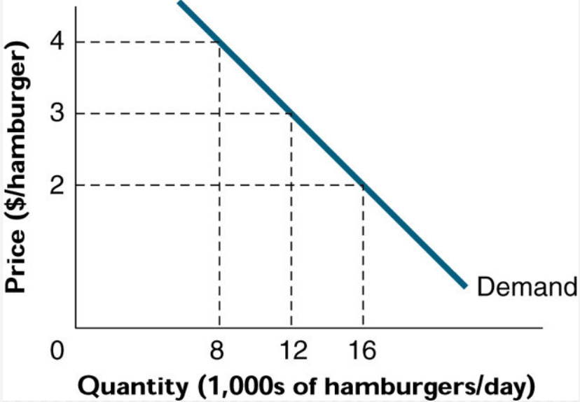
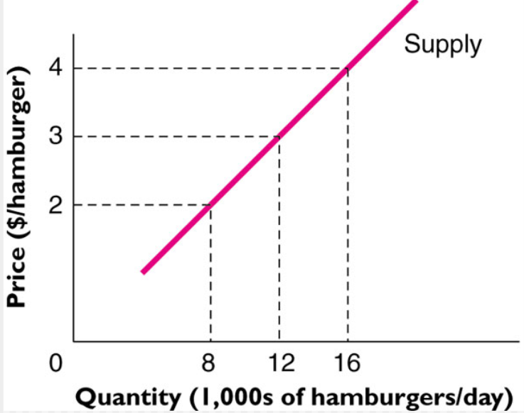
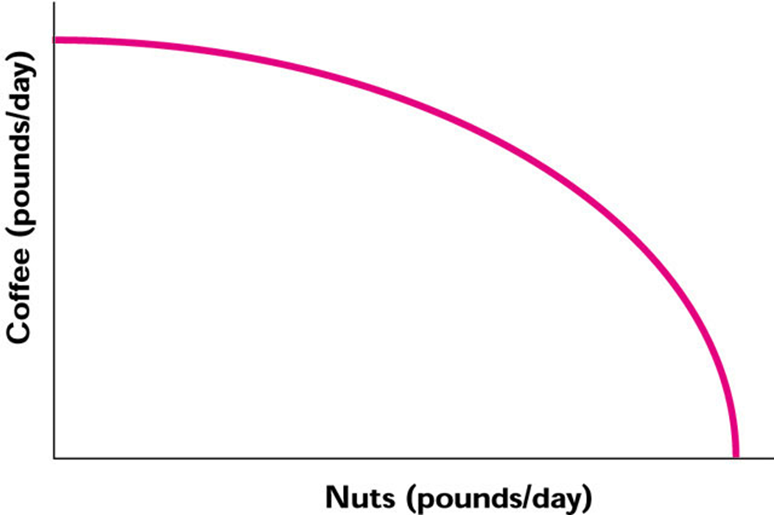
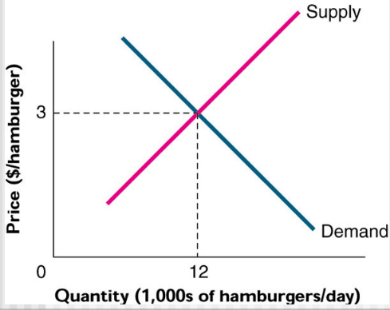
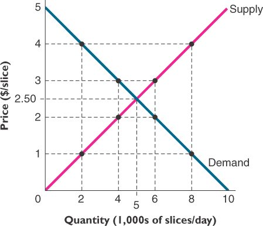
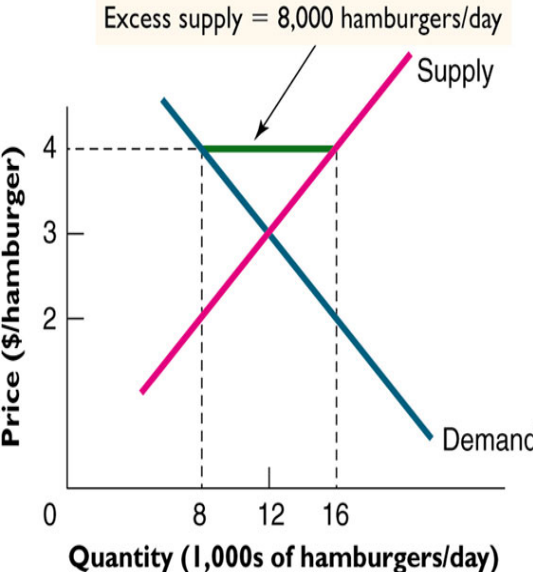
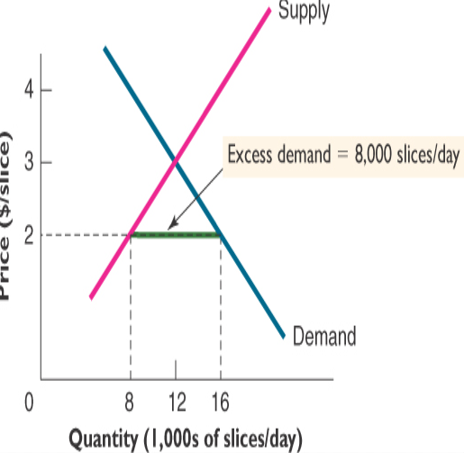

# 4.1 供給與需求的推導

## 供給的要義
* 生產什麼，生產多少
* 用什麼技術，用什麼資源
* 何時生產，時間點如何掌握
* 為誰生產，如何分配產品與所得
## 需求的要義
* 需求什麼，需求多少
* 用什麼資源
* 何時需求，時間點如何掌握
* 為誰需求，如何分配所購產品
## 市場結構與社會福利
* 中央集權 Central Planning
    * 史前農業社會，前蘇聯，北韓，中國大陸改革開放之前
    * 國家機器或集體意志決定經濟的生產
    * 個人在生產及消費上沒有完全自由的意志
    * 有些特殊例子，甚至連生育子女的數目都要受到管制
* 自由市場 Free Market
    * 大多數國家都是市場經濟
    * 資本主義經濟 Capitalist economies
    * 個人意志決定經濟行為，包含就業、生產、定價、消費、旅遊、遷移

## 市場機制下的效率原則 Market mechanism leads to efficiency principle
* 市場機制 (market mechanism) 等同於價格機制 (price mechanism) 
* 價格是引導資源配置的信號 (signal)
* 如果價量彼此相關，為何價格是信號但數量不是？
    * 因為價格隨處可見 (observable)，但是數量未必可見 (unobservable)
* 供給和需求來自不同的力量主導，前者來自供給者，後者來自需求者
* 當供給和需求雙方達於均衡時，社會就達到最效率境界
* 透過市場機制可以追求社會福利最大：效率原則
* 回顧第一章的決策準則：MB = MC，保證經濟剩餘加總的最大化

## 市場上的供給有無短缺或不足
* 遊覽車的供應在旺季時可能不足
*  看不見的手原則 (invisible hand principle)
* 政府管制遊覽車的牌照，政府管制數量之後，就可能造成供需失衡

## 市場上的買者與賣者 Buyers and Sellers in the Market
* 買者和賣者雙方的動機不同
    * 買者要從所購買的財貨取得效益
    * 賣者要從所出售的財貨獲取利潤
* 買賣雙方在市場碰面
    * 買賣雙方共同決定財貨的交易
* 價格平衡供需雙方力量
    * 價格對於供需雙方有不同的意義
    * 對買者而言，價格是效益
    * 對賣者而言，價格是成本
    * 回顧第一章的保留價格概念，效益面是買者願意出的最高價，成本面是賣者願意接受的最低價
* 任一財貨或勞務的市場，皆由買者與賣者構成
    * 其中包含可能或確實的買者
    * 也包含可能或確實的賣者
    * 來市場的人，不管是買者或賣者，不是每個人都會在每個項目上進行買 (賣) 的行為
    * 他們心中都有保留價格，端視保留價格和他們所看到的賣者或買者的出 (售) 價比較，才會決定是否交易
* 買者和賣者如何溝通？
    * 透過市場，市場機制決定供給和需求雙方對於數量和品質的要求與配置 
* 為何有些市場均衡結清，有些市場不均衡？
    *  政府管制造成財貨勞務配置不均衡 

## 價格是如何決定的
* 為何有些東西貴，有些東西便宜？
    * 每個人的認知都不同，貴賤與否，和每個人心中的保留價格有關
    * 所以，同樣的東西，有些人覺得貴，有些人覺得便宜
* 價格取決於兩個因素：
    * 生產成本：
        * 高級貨或廉價品，一分錢一分貨
    * 主觀價值：
        * 黃金或鑽石，古董或名畫

## 需求曲線的推導
* 需求是價量之間的負向關係
* 直接的理由是邊際報酬遞減
    * 需求者的保留價格，是願意支付購買某一數量的最高價格
* 數量愈大，願意支付的邊際保留價格愈低
* 所以，下一個單位的價格要下降，才會持續買；價格上升買不起，就會減少購買
* 價格上漲帶來兩個效果
    * 替代效果 (substitution effect)：價格變貴就買其他便宜的產品來替代
    * 所得效果 (income effect)：價格變貴後整體購買力 (purchasing power) 下降，因此買得少
#### 購買力的概念：實質與名目 Real vs. Nominal
* 購買力 (Purchasing power) 的概念
* 名目所得 
    * 以貨幣表示的所得絕對值
* 實質所得 
    * 相對於某一價格水準的所得
    * 實質購買力
* 不同時期的所得水準高低，不必然表示購買力高低，必需考慮各時期的物價水準才公平
* 就如同不同國家的所得水準，受到各國幣值兌換美元匯率的影響
* **nominal does not matter, real matters**

* 圖 4.1 麵包的需求曲線

## 供給曲線的推導 Supply Curve
* 供給線是每個價格下， 生產者願意提供的數量，價量關係是正向的 
    * 生產數量的多寡和機會成本 (其實就是生產成本，因為放棄的最佳選擇) 有關
    * 某一財貨的價格愈高，超過生產此財貨的機會成本也愈高，供給量愈大；低果先摘原則
* 機會成本不同
    * 技術	  　
    * 成本
    * 技能	  　
    * 預期
* 價格愈高，廠商願意摘下來賣的果子也愈高愈難摘
* 圖4.2  麵包的每日供應量—低果先摘法則

*  <strong>從生產可能線和價格線可以推導出供給線</strong>

## 市場均衡與失衡 Market Equilibrium and Disequilibrium
* 當買方與賣方都滿意於市場的價格與數量時
    * 穩定均衡，表示若無其他外力，均衡點會一直存在
    * 供給線與需求線的相交點
    * 均衡價格：均衡點之下供需雙方合意的價格
    * 均衡數量：均衡點之下供需雙方合意的數量

 

* 當價格沒有停在供需線的交叉點時，就是供需的失衡
* 超額供給
    * 價格高於均衡價格，造成賣方剩餘
    * 賣方不滿足
    * 供過於求
* 超額需求
    * 價格低於均衡價格，造成買方短缺
    * 買方不滿足
    * 供不應求

* 超額供給 v.s. 超額需求

## 失衡的調整
* 超額供給的調整
    * 供過於求，穀賤傷農，價格下降，需求增加，供給減少
* 超額需求的調整
    * 供不應求，穀貴傷民，價格上升，需求減少，供給增加
* 藉由價格的調整，趨向供需均衡
* 有哪些財貨的超額需求與供給是短時間內均衡的？
    * 外匯、股票、蔬菜、書本、雜貨

## 立法管制與市場機制 Legislation and Market Mechanism
* 市場均衡並不代表每個人的慾望得以滿足
* 市場上有可能的買者和賣者
* 沒有達成交易的人，可能是保留價格不合乎市場均衡價格
* 出價太低 (預算受限)，無法購買；售價太高 (成本受限)，無法賣出
* 政府因此可能透過立法管制價格
* 價格上限 (price ceiling) 政策保護消費者
    * 最高價格由法律制訂
    * 價格太低，消費者需求過多
    * 例如油電水價格凍漲，國外有房租管制
    * 結果是過度消費或是短缺，造成不效率
* 價格下限 (price floor) 政策保護生產者
    * 最低價格由法律制訂
    * 價格太高，生產者生產過多
    * 例如最低工資、農產品保證收購價格
    * 結果是過度生產，造成不效率

## 經濟學家與貧窮問題 Economists and the Poverty Problem
* 經濟學家不傾向於用干預市場經濟的方式來解決貧窮問題
* 直言之，價格管制通常是不效率的
* 政府管制汽油、水、電價格是不效率的
* 管制帶來的不效率如何衡量？
* 社會最適數量就是追求最大的經濟剩餘
    * MB = MC 效率的準則，第一章圖形，經濟剩餘三角形加總最大
* 只有一個生產點（消費點）是明智的，其他都是不智的 “Smart for one Dumb for all”
* 只有在這一點上消費者和生產者經濟剩餘加總最大
* 從社會觀點來看，經濟效率是社會最適
* 效率原則 (Efficiency Principle)
    * 追求效率是重要的社會目標 (social goal)
    * 首要目標是創造更大的派，讓每個人可能分到的份額增加
* 均衡原則 (Equilibrium Principle)
    * 達到均衡的市場，沒有尚未開發的機會或利益
    * 還是依循 MB = MC 的原則，隱含個人最適化就是社會最適化
    * 桌上沒有現金 (No “cash on the table” remains)
    * 任何有利可圖的機會都被開發了
* 此前都沒有提到分配的問題
* 效率是第一考量，分配是次要問題

## 討論主題
* 需求曲線反映邊際效益遞減法則，有無違背的例子
    * 新冠病毒的疫苗，就算在怎麼貴，為了活下去，還是會很多人願意買。
* 供給曲線反映邊際成本遞增法則，有無違背的例子
    * 廠商想要做慈善，刻意壓低價錢，讓弱勢團體可以低價買進。
* 供需均衡一定存在嗎？自然或人為的？
    1. 一定存在。
    2. 兩者都有，但是人為的方式，到最後都容易照成供需失衡。
* 供需失衡時，調整的速度與方向何在？
    * 會看這個商品在這市場上流動律率，像是都市中的股價和鄉村中水價，前者調整速度快，後者如果發供需失橫衡，會花較長時間才會達到平衡，不過兩者都會向供給和需求線的焦點移動。
* 供需均衡一定帶來個人和社會最適化的同時達成嗎？
    * 一定會帶來社會最適化，但個人最適化則不一定，就像政府停止補助電價和水價，突然上漲，不管是廠商或一般百姓一定會抗議。

## 問題

1. 在供需法則的運作下，下列何種情形屬於市場上「供過於求」的現象？
    1. 母親節時的康乃馨價格
    2. 商業蛋黃區的土地價格
    3. 颱風剛過後的蔬菜價格
    4. 果農豐收時的水果價格
    
2. 下列關於市場均衡與失衡(Market Equilibrium and Disequilibrium)的敘述何者
錯誤？
    1. 當價格沒有停在供需的均衡點時，即為供需失衡
    2. 供過於求即賣方不滿足
    3. 超額需求是指，價格高於均衡價格所造成的現象 
    4. 當市場出現供不應求，透過市場機制調整，需求量會減少，供給量會增加 
