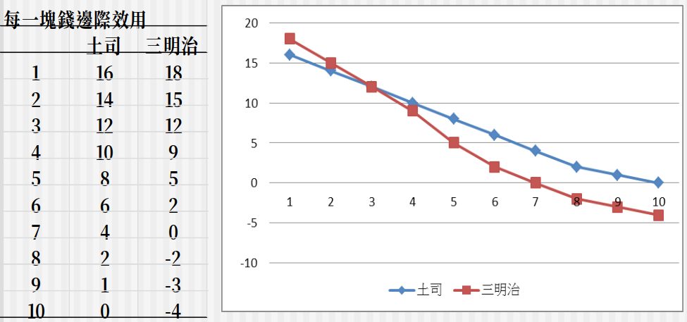
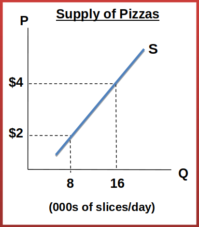

# 4.2、供給與需求的互動
## 從需要 (want) 到需求 (demand)
* 基本的生活需要達到之前，仍舊是經濟學討論的範疇
* 如何在有限資源內，維持生命的存續
* 滿足基本的生活需要之後，經濟學就可以專注討論各種需求
* 即便有無限的金錢，也無足夠的時間與精力從事無限的消費，因此人們追求的是限制下個人需求的極大滿足
* 如何將有限的資源配置在各種項目上，達到最大的滿足，就是決策的問題
* 透過模型來闡釋最適決策的原則

## 想望的衡量 measuring wants
* 傳統經濟學家認為人們消費帶來效用 (Utility)，滿足人們心中的想望
* 如何衡量人們心目中的想望、快樂或痛苦？
* 十七世紀英國哲學家：J. Bentham 邊沁
* 被視為是現代效用主義 (utilitarianism) 的創始人
* 和 J. S. Mill 彌爾是影響近代效用主義的兩大人物 
* 提出效用度量衡的概念 utilometer
* 假設人們可以對每一個消費項目賦予效用高低，以效用單元 (utils) 來表達
* 人們會追求所有消費帶來的效用單元加總最大化

## 效用、總效用和邊際效用
* 效用是消費帶來的滿足感
* 效用極大化 (Utility Maximization) 是在有限的所得下追求最大的滿足
* 一般而言，消費是愈多愈好，多多益善
* 但是消費過多會帶來負效用
* 邊際效用遞減法則

#### 消費麵包的總效用圖形

#### 邊際效用：額外增加一單位消費所帶來的效用增加

## 邊際效用遞減法則
* 邊際效用遞減法則 The Law of Diminishing Marginal Utility
*  超過某一個消費水準之後,邊際效用遞減
* 有無邊際效用遞增的例子？
    * 聽到新歌曲、運動後在飲水機喝水
    * 從一日三秋，到一日三餐，到度日如年

## 最適的財貨消費組合 Optimal Combination
* 在預算可以負擔的範圍下，追求最高的效用加總
* 分配預算的原則，就是從最高的邊際效用開始，逐一將預算配置下去
* 一直到最後一塊錢帶來的邊際效用，在各財貨上面都相等為止
#### 消費土司與三明治的總效用

#### 每單位邊際效用和每塊錢邊際效用

## 理性支出法則
* 各種項目的每一元的邊際效用相同

* 每一元的邊際效用 =

* 直接由成本效益分析法則引申而來
在多種項目上遵循MB >= MC的法則

## 供需模型的專有名詞
* 在需求與供給的圖形上，外生(exogenous)與內生(endogenous)變數如何認定
    * 內生變數：模型內的變數，此處是價格和數量
    * 外生變數：模型外的變數，就是價格和數量之外的
* 如果是內生變動，就是價量的變化
    * 需求量變動，線上移動 (movement)；價格隨之轉變 
    * 供給量變動，線上移動 (movement)；價格隨之轉變 
* 如果是外生變動，就是線段的移動
    * 需求線平移變動 (shift)
    * 供給線平移變動 (shift)

## 需求量與需求的變動 Movement along the Demand Curve
* 價格下降，需求量增加
* 價格上升，需求量下降
* 價格變動引起需求量改變

## 供給量與供給的變動 Shift in Demand
* 買者在每個價格下的需求增加，亦即保留價格上升
* 整個需求線往右平移
* 買者在每個價格下的需求減少，亦即保留價格下降
* 整個需求線往左平移

## 供給與需求的變動 
* 價格上升，供給量增加
* 價格下降，供給量下降
* 價格變動引起供給量改變

## 不同財貨間價量關係的對照 Shift in Supply
* 賣者在每個價格下的供給增加，亦即保留價格下降
* 整個供給線往右平移

* 賣者在每個價格下的供給減少，亦即保留價格上升
* 整個供給線往左平移

## 需求量增加 v.s. 需求增加，兩者的成因有何不同?
* 需求量變動是內生造成的，其餘的外生成因都引起需求變動

## 供給需求同時變動 Shifts in Demand and Supply
* 影響需求變動的外生因素如下：
    * 互補品Complements
    * 替代品Substitutes
    * 所得Income
    * 偏好Preferences
    * 買者的數目 (人口) population
    * 預期expectation
* 這些都是模型中的外生因素

* 影響供給變動的外生因素 (P 之外) 如下：
    * 生產成本Changes in the Cost of Production
    * 生產技術Changes in Technology
    * 氣候Changes in Weather
    * 賣者的數目 (勞動者) Number of sellers in Market
    * 預期Changes in Expectations

### 玻璃纖維原料價格上升，滑板供給線左移

### 木匠工資下降，住宅供給線右移

## 不同財貨間價量關係的對照
*  互補品 Complements 
    * 兩種財貨帶來的效益不同，合用時效益較大，分開用時效益較小
    * 例如：汽車和汽油，籃球和籃球場地，咖啡和糖，豆漿和燒餅
    * 定義：一種財貨的價格上升，另一種財貨的需求下降
    * 嚴格互補品：一定要同比例使用
    * 左右腳鞋，眼鏡和鏡片
    * 例子：網球場租金下降，網球需求增加，網球和網球場是互補品
* 替代品 Substitutes
    * 兩種財貨帶來的效益相近，分開用時效益較大，合用時效益減少
    * 例如：可樂和汽水、咖啡和茶葉、汽車和公車
    * 定義：一種財貨的價格上升，另一種財貨的需求增加
    * 嚴格替代品：幾乎相同的財貨
    * 不同顏色的鉛筆
    * 什麼東西幾乎沒有替代品？
        * 鹽，救命的藥，上癮的東西
## 所得和財貨需求的關係
* 正常財 Normal good
    * 當所得增加對於該財貨需求也增加
    * 例子：高級牛排
* 劣等財 Inferior good
    * 當所得增加對於該財貨需求減少
    * 例子：泡麵

## 供需模型中的經濟剩餘
* 消費者剩餘：消費者的保留價格減去市場價格
* 生產者剩餘：市場價格減去生產者的保留價格
* 經濟剩餘的加總：生產者剩餘和消費者剩餘的加總
* 供需模型中的經濟剩餘達到最大化的時候，桌上就沒有現金留下來
* 額外的銷售或購買，不會帶來更大多的經濟剩餘
* 剩餘最大化，所有的機會都被開發殆盡
### 消費者與生產者剩餘

### 畫一個圖表示消費者剩餘和生產者剩餘如何可以擴大生產者剩餘
* 例子：高鐵學生價、老人票

## 效率原則
* 效率原則下，財貨的供需是社會最適數量，使得總剩餘最大化
* 供需模型的均衡數量和價格，是效率原則的結果
* 供需均衡是 MB = MC，保證總剩餘極大化
* 只有一處聰明，其餘皆否；Smart for One, Dumb for All
* 供需均衡真的保證聰明嗎？
    * 當外部性 (externalities) 存在時，這個結果就不成立
* 效率原則的前提是沒有外部性，邊際成本和邊際效益忠實反映供給者和需求者的機會成本
* 什麼情況下會有外部性：
    * 超乎自身成本之外的供給成本：排放污染，行為不檢
    * 超乎自身利益之外的需求效益：施打疫苗，受教育

## 均衡原則 Equilibrium Principle
* 達到均衡時，沒有未開發的機會存在
* 如果在集體行為 (collective action) 之下，可能沒有完全開發
* 例如集體農場，共同生產行為
* 同樣的，外部性也會帶來類似的偏誤
* 唯有當所有的成本和效益，都切實歸屬於每個生產者和消費者，亦即沒有外部性時，均衡原則才成立
* 各種類型的管制、租稅、罰鍰和補貼，原則上都是為了消除這些達到效率原則和均衡原則的可能阻礙，使市場更接近效率結果和最適化

## 討論主題
* 理性支出法則是否合乎直觀？
    * 不太符合，因為人時常不太理性，但如果已長時間來看，絕對是符合的。

* 供需模型看來無所不能，什麼時候供需模型無法解釋，或是供需模型無著力之處？
    * 有外力接觸時，如隨意哄抬價格，戰爭爆發，政府大量印紙幣

* 如果供需模型大概都存在一般人的心目中，為何有時候會需求過多？有時候供給過剩？
    * 因為人時常不理性的，像是疫情爆發，民眾瘋搶泡麵和衛生紙，造成需求過多。或是前幾年蛋塔在台灣風行，一下子開了很多蛋塔販賣店，但這個風潮過了以後，需求減少，供給就過剩，導致許多商家血本無歸
* 供給和需求都是立刻實現的決策嗎？有沒有時間落後的限制？
    * 有，像是去年疫情剛爆發口罩短缺，需求過大，供給不夠，但還是要過一陣子，供給才可以補上供給和需求才可以達成

* 供需模型所依賴的前提假設，也就是沒有外部性的情況，是否普遍存在？
    * 沒有，人事有欲望的，一定會利用自己的力量，影響市場，來獲得更大的利益

## 問題
* 下列關於需求與供給的互動結果何者正確？ 
(A)需求增加，供給減少，則均衡數量必定會下降 
(B)需求減少，供給增加，則均衡價格必定會上升 
(C)需求增加，供給增加，則均衡價格變動方向不一定  
(D)需求減少，供給減少，則均衡數量變動方向不一定 

* 咖啡和奶精為互補品，下列何種情況會發生： 
(A)咖啡價格上升時，奶精需求線向左平移  
(B)咖啡價格上升時，奶精需求線向右平移 
(C)奶精價格上升時，咖啡需求量沿著需求線降低 
(D)奶精價格上升時，咖啡需求量沿著需求線增加 

* 下列關於立法管制與市場機制的敘述何者正確？ 
(A)價格上限政策保護消費者，價格下限政策保護生產者 
(B)價格上限造成供不應求，價格下限造成供過於求 
(C)電水價格凍漲與房租管制皆屬於價格上限管制 
(D)最低工資屬於價格下限管制 
(E)以上皆正確   