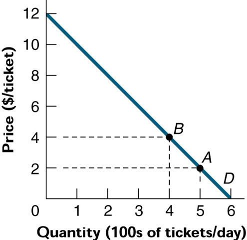
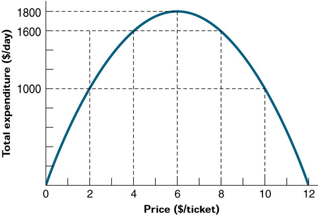
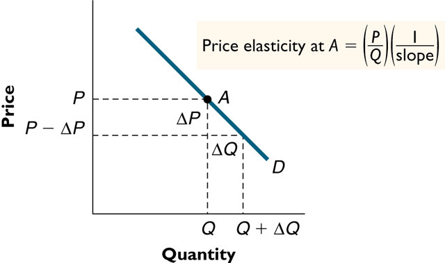
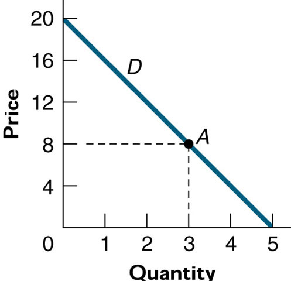

# 5.彈性的概念
## 總支出與總收益
* 總支出等於均衡價格乘以均衡數量
* TE=P*Q
* 消費者的總支出，等於生產者的總收益
* 一體兩面
    * 總收益是營業額的概念
    * 從供給者的角度來看，他要想的是如何可以讓消費者支出最多
    * 所以生產者關心的不止是他自己的成本函數，他同時也關心消費者的需求函數
    * 目的在追求利潤最大化
## 總收益與價格的關係

**不同價格下的總收益等於多少?**

**橫軸是價格，縱軸是總收益，隨著價格變動，呈現先遞增後遞減的情況**

## 需求法則與總支出的關係The Law of Demand and Total Expenditure
* 價格變動的過程中，總支出可能上升、下降或不變
* 受制於需求法則的運作，兩股力量交互運作
* 一個是價格上升，需求減少
* 一個是價格下降，需求增加
* 但是價量之間的抵換，對於總支出 (收益) 的影響，結果不一定
* 牽涉的就是彈性 (elasticity) 的問題
* 供給者念茲在茲的，就是需求者的彈性大小，以此作為定價 (pricing) 的依據

## 需求的價格彈性 elasticity
* 要知道價格變動之後總支出的變化如何
    * 就必須同時瞭解價格變化之後數量的變動
* 需求的價格彈性
    * 需求數量變動的百分比相對於價格變動的百分比
* 不同財貨的特性，價量互動的關係也有不同
* 想像路邊攤的需求線，和高級餐廳的需求線，是否相同？
* 以圖形來表達，差異何在？

## 計算需求價格彈性
* 顯然，路邊攤和高級餐廳的差異，表現在需求線的斜率不同
* 亦即價格做一單位的變化時，數量的反應程度不同
* 彈性的定義：數量變動百分比對於價格變動的百分比
* 價格變動百分之一，數量變動的百分比
* 為何不直接看價格變動引起的數量變動，而必須以百分比來看待？
    * 不同的物品所用的計算單位不同
    * 同一種物品，不同時間的價格基準也有不同
* 以變動百分比來觀察，目的是為了標準化，便於做跨物品或跨時間的比較
---

$\dfrac{\dfrac{dQ}{Q}}{\dfrac{dP}{P}}$ = $\dfrac{P}{Q} * \dfrac{dQ}{dP}$ = $\dfrac{P}{Q}*\dfrac{1}{slope}$

彈性和需求線的斜率有關，同時也和特定位置下的價量水準有關 (價量高低攸關支出變化程度)

---

$\dfrac{P}{Q} * \dfrac{1}{slope} = \dfrac{8}{3} * \dfrac{-1}{slope}$

彈性和特定位置下的價量水準有關係
什麼情況下可以只比較斜率來決定兩條需求線彈性的高低?

---
* 需求彈性都是負的，因為需求曲線的價量關係是負向的
    * 為了方便，需求彈性通常都取絕對值
* 富有彈性 (Elastic)；彈性> 1
    * 數量變動百分比高於價格變動百分比
    * 降價會使得總收益增加，漲價則反之
* 不具彈性 (Inelastic) 彈性 < 1
    * 數量變動百分比低於價格變動百分比
    * 漲價會使得總收益增加，降價則反之
* 單一彈性 (Unit elastic) 彈性 = 1
    * 數量變動百分比等於價格變動百分比
    * 價格變動和數量變動效果彼此抵銷，總收益不變

## 價格彈性和支出 Price Elasticity and Expenditures
* 有彈性的需求
    * 數量變化的反應大於價格的變化
    * 數量反應的效果決定結果
    * 價格上升，總支出下降
    * 價格下降，總支出增加
    * 薄利多銷 (例子: 夜市拍賣會)
    * 

* 缺乏彈性的需求
    * 數量變化的反應小於價格的變化
    * 價格反應的效果決定結果
    * 價格上升，總支出上升
    * 價格下降，總支出減少
    * 囤積居奇(疫苗)
    * 例子：墨前總統表態　支持毒品合法化
        * 在近乎垂直的需求線之下，唯有市場機制能夠打破暴利；反之，政府可以對這種需求課稅牟取大量稅收
        * 早期的菸酒稅、汽車關稅，古時候的鹽鐵稅

| 品項 | 彈性大 | 彈性小 |
|-----|-------|-------|
|食物  |自助餐  |高級餐廳|
|衣物  |普通地攤貨|高級時裝|
|房屋|平價住宅|豪宅|
|其他|汽車|大眾運輸工具、大學教育|

## 影響需求彈性的因素
* 替代品的有無--食鹽、救命的藥、上癮的物品
    * 替代品愈多，價格彈性愈大
    * 因為可以移轉到其他財貨上，所以需求量對於價格變動很敏感
    * 替代品愈少，價格彈性愈小；沒有東西可以取代，一定要購買
* 佔預算支出比例的大小– 住宅 v.s. 肉燥飯
    * 佔預算支出比例愈大，對於價格變化的反應愈敏感
* 調整時間的長短—短期與長期
    * 替代品的取代需要時間，長期的價格彈性比短期來得大
    * 因油價上漲，大車換小車，小車換機車，機車換公車

## 所得彈性與交叉價格彈性
* 需求的所得彈性 (income elasticity of demand) 
    * 百分之一的所得變動，對於需求數量帶來的變動百分比
    * $ \dfrac{\dfrac{dQ}{Q}}{\dfrac{dY}{Y}}$ 
    * 記得正常財與劣等財
    * 這兩種物品的嚴格定義，是透過需求的所得彈性而來
* 交叉價格彈性(Cross Price Elasticity of Demand)
    * 其他物品價格變化百分之一，對本物品需求變動百分比的影響
    * $ \dfrac{\dfrac{dQ}{Q}}{\dfrac{dP}{P}}$ 
    * 記得替代品、互補品
    * 這兩種物品的嚴格定義，是透過交叉價格彈性而來

## 完全彈性與完全無彈性
* 完全彈性
    * 需求的價格彈性等於無限大
    * 價格微小變動，會使得消費者完全移轉到替代品
    * $\dfrac{\dfrac{dQ}{Q}}{\dfrac{dP}{P}}$ =  ∞  = $\dfrac{P}{Q}*\dfrac{1}{slope}$
    * 需求線為水平，斜率為零
    * 例子？（有百事可樂，有可口可樂）
* 完全無彈性
    * 價格彈性等於0
    * 沒有替代品可以取代,
    * $\dfrac{\dfrac{dQ}{Q}}{\dfrac{dP}{P}}$ =  0  = $\dfrac{P}{Q}*\dfrac{1}{slope}$
    * 需求線為垂直，斜率無限大
    * 例子？(心臟病藥)

## 問題
* 如果生菜價格下降時，沙拉醬的需求提升，那麼生菜及沙拉醬之間的需求交叉彈性為何?兩者互為何者財貨? 
(A)交叉彈性為0；互為替代品 
(B)交叉彈性為0；互為互補品 
(C)交叉彈性為負向相關；互為互補品 
(D)交叉彈性為負向相關；互為替代品

* 下列關於彈性的敘述何者正確？  
(A)當財貨為正常財，其所得彈性為正相關 
(B)當財貨為劣等財，其交叉彈性為負相關 
(C)當財貨互為互補品，其交叉彈性為正相關 
(D)當財貨互為替代品，其交叉彈性為負相關

## 討論主題
* 路邊攤調整價格和大餐廳調整價格，帶來的後續效果會一樣嗎？
    * 要看價格調整的比例，如果比例是一樣的，那後續的效果會差不多。
* 大學學費提高，是否會阻礙多數人的求學之路？
    * 不太會，因為教育沒有替代品，彈性小，但是學費一直太高，會讓國家較難發展更多高技術性人才。 
* 菸酒稅提高，是否可以具體減少抽煙和酗酒的人口數，改善國民健康
    * 可以，雖然菸酒的彈性非常小，但一就會有抑制抽煙和酗酒的人數
* 為何經濟學家會提倡毒品合法化和市場化？
    * 因為毒品對於某些人而言是必須品，如果完全禁止毒品的存在，在些人就會在黑市購買，會讓政府減少稅收，甚至造成更多社會問題
* 對未婚者課徵單身稅，可以促進人口增加嗎？
    * 不會，因為單身的問題，不可以只用經濟學角度來看，這牽扯到女性地位提高、社會的經濟規模等等